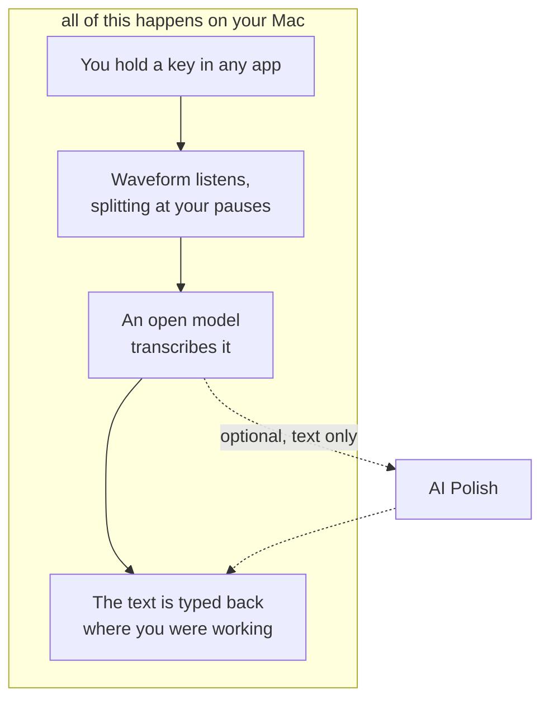

# Waveform

A free ASR tool for macOS, running open-source speech models on your own
machine.

## Why

Speaking is the fastest way to get words into a computer, and almost every tool
that does it well begins by uploading your voice — usually for a subscription.

That trade stopped being necessary. The open speech models are good now, and
fast: Whisper transcribes eleven seconds of speech in under half a second on an
M1 Pro. The Mac in front of you is already enough to run them.

Waveform is those models, given a key to listen for and somewhere to put the
text. It is free, there is nothing to sign into, and your voice does not go
anywhere.

## Install

Download the disk image from [the latest release](https://github.com/vipiny35/waveform/releases/latest)
and drag Waveform to Applications. It is signed and notarised, so it opens
without a warning.

On first launch, **Settings → Setup** asks for the three things macOS will not
grant on Waveform's behalf: the microphone, permission to see your key while
another app is focused, and permission to type the text back.

Needs an Apple Silicon Mac on macOS 13 or newer.

## How it works

The dotted path is the only part of this that leaves your Mac. It carries text
rather than audio, and it runs because you pressed something.

## A few things worth knowing

- **It works in every app.** Mail, a browser, a terminal — anywhere there is a
  cursor.
- **Open models, switchable.** Every size of
  [Whisper](https://github.com/ggml-org/whisper.cpp) — Tiny through Large v3,
  quantized or not, multilingual or English-only — runs inside the app and needs
  nothing installed; Settings → Models marks the one that fits the memory your
  Mac has. [Parakeet](https://huggingface.co/nvidia/parakeet-tdt-0.6b-v3) and
  [Qwen3-ASR](https://huggingface.co/Qwen/Qwen3-ASR-0.6B) are there too, if you
  want them.
- **It waits until you finish.** Text arrives when you stop speaking, so a
  sentence never lands half-written somewhere.
- **It lives in the menu bar.** Closing the window does not quit it, and
  dictation keeps working with nothing on screen.

## Privacy

Your voice is heard and transcribed entirely on your own Mac. It is not
uploaded, and there is no server to upload it to.

Two things do reach the network, both by your choice:

- **AI Polish**, when you press it, and only ever the text.
- **The update check**, which you can switch off in **Settings → General**.

## Docs

- [Using Waveform](docs/using.md) — gestures, trigger keys, AI Polish, updates
- [Building](docs/building.md) — toolchain, signing, running from source
- [Architecture](docs/architecture.md) — how the pieces fit
- [Models](docs/models.md) — how a model id becomes a running engine
- [Updates](docs/updates.md) — how a release reaches an installed copy

## Contributing

Issues and pull requests are welcome — [CONTRIBUTING.md](CONTRIBUTING.md) has
what you need to get building.

One thing before a large one: Waveform's premise is that audio stays on your
Mac. A change that sends audio anywhere is not a feature this app can take,
however good it is. Text is different.

## Support

Waveform is free. If it saved you some typing, you can
[buy me a coffee](https://buymeacoffee.com/vip_iny).
