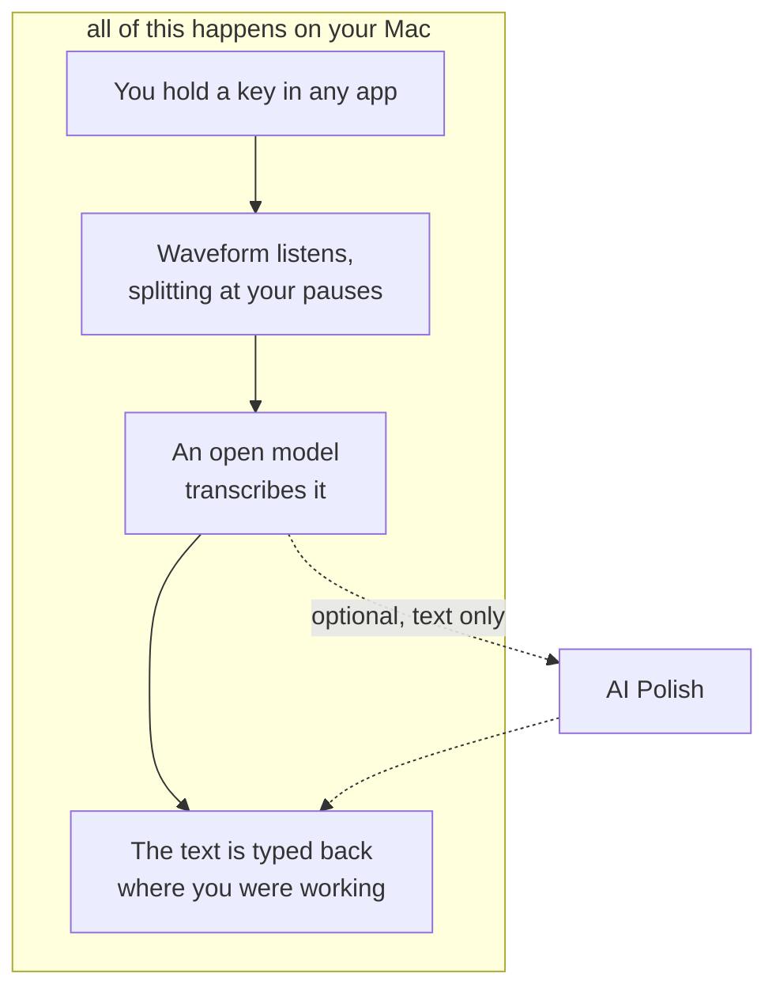

# Waveform

A free ASR tool for macOS, running open-source speech models on your own
machine.

## What it does

Hold a shortcut, speak, and release to insert text into the focused app.
Waveform combines a Tauri desktop app, a native macOS helper, and local speech
engines. No account or subscription is required.

- **Local transcription:** built-in whisper.cpp, with optional Parakeet and Qwen3-ASR.
- **Dictation controls:** hold to speak, double-tap to lock, and Escape to cancel.
- **Menu bar and Wave Bar:** keep dictation available while working in other apps.
- **Optional AI Polish:** send text through OpenRouter to your selected model when requested.

Apple Silicon and macOS 13 or newer are required. Intel Macs, Windows, and Linux
are not currently supported. Waveform is pre-1.0; behavior may change between releases.

## Install

Download the disk image from [the latest release](https://github.com/vipiny35/waveform/releases/latest)
and drag Waveform to Applications. Official release builds are signed and notarised.
If no release is available yet, follow the [source build guide](docs/building.md).

On first launch, **Settings → Setup** asks for the three things macOS will not
grant on Waveform's behalf: the microphone, permission to see your key while
another app is focused, and permission to type the text back.

Needs an Apple Silicon Mac on macOS 13 or newer.

## How it works



The dotted path sends text through OpenRouter to your selected model when requested.
Model downloads and update checks also use the network; see [Privacy](#privacy).

## A few things worth knowing

- **Insert into the focused app.** Works with standard editable text fields;
  secure fields and apps that restrict synthetic input may behave differently.
- **Open models, switchable.** Every size of
  [Whisper](https://github.com/ggml-org/whisper.cpp) — Tiny through Large v3,
  quantized or not, multilingual or English-only — runs inside the app and needs
  nothing installed; Settings → Models marks the one that fits the memory your
  Mac has. [Parakeet](https://huggingface.co/nvidia/parakeet-tdt-0.6b-v3) and
  [Qwen3-ASR](https://huggingface.co/Qwen/Qwen3-ASR-0.6B) are there too, if you
  want them.
- **It waits until you finish.** Text arrives when you stop speaking, so a
  sentence never lands half-written somewhere.
- **It lives in the menu bar.** Closing the window does not quit it, and
  dictation keeps working with nothing on screen.

## Privacy

Your voice is heard and transcribed entirely on your own Mac. It is not
uploaded, and there is no server to upload it to.

Network activity includes:

- **AI Polish**, when you request it, sends text through OpenRouter to your selected model.
  OpenRouter and the model provider's privacy and retention terms apply.
- **Model and optional runtime downloads**, during setup or model installation.
- **The update check**, which you can switch off in **Settings → General**.

## Build from source

Install the [toolchain prerequisites](docs/building.md#toolchain), then:

```sh
git clone https://github.com/vipiny35/waveform.git
cd waveform
pnpm install --frozen-lockfile
WAVEFORM_SIGN_TEAM=YOURTEAMID pnpm app
```

Use your own Apple development team/certificate for the local app. Typechecking,
unit tests, and the frontend/helper build do not require distribution credentials.
See [Contributing](CONTRIBUTING.md) for the first-PR workflow.

## Docs

- [Using Waveform](docs/using.md) — gestures, trigger keys, AI Polish, updates
- [Building](docs/building.md) — toolchain, signing, running from source
- [Architecture](docs/architecture.md) — how the pieces fit
- [Models](docs/models.md) — how a model id becomes a running engine
- [Updates](docs/updates.md) — how a release reaches an installed copy
- [Releasing](docs/releasing.md) — maintainer build, review, and publish checklist
- [Support](SUPPORT.md) · [Security](SECURITY.md) · [Code of conduct](CODE_OF_CONDUCT.md)

## Contributing

Issues and pull requests are welcome — [CONTRIBUTING.md](CONTRIBUTING.md) has
what you need to get building.

One thing before a large one: Waveform's premise is that audio stays on your
Mac. A change that sends audio anywhere is not a feature this app can take,
however good it is. Text is different.

## License

Waveform's source code is available under the [MIT License](LICENSE).
Third-party dependencies, speech runtimes, model weights, and third-party assets
remain subject to their own licenses.

## Support

Waveform is free. If it saved you some typing, you can
[buy me a coffee](https://buymeacoffee.com/vip_iny).
