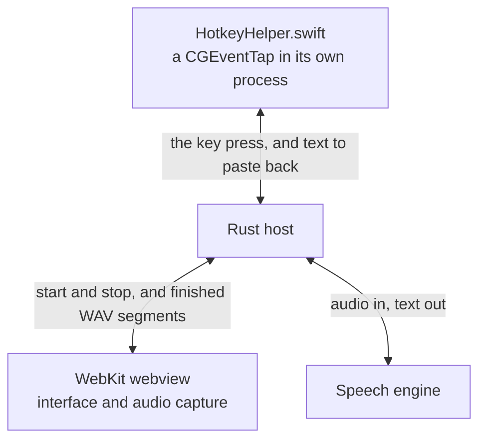

# Architecture

`README.md` has the diagram. This is what each box actually is, and why the
split falls where it does.

## Three processes

The helper and the Rust host speak newline-delimited JSON over stdio.

**The webview** owns the interface, audio capture, segmentation and the overlay
meter. It talks to Rust through the `window.waveform` surface in
`src/renderer/host.ts`. `getUserMedia`, `AudioContext` and `ScriptProcessorNode`
all work there, so audio never has to cross into Rust — only finished WAV
segments do.

**The Rust host** owns everything the page cannot do for itself: the speech
engines, the dictation state machine, the overlay window, the global shortcuts,
the rewriting -- llama.cpp in-process for the local models, HTTP for OpenRouter --
and the keychain.

**The Swift helper** is neither, and exists because no API lets an app see Fn
pressed while another app is frontmost, or type into one. That needs a
`CGEventTap` and synthetic `CGEvent`s. It is a separate process speaking
newline-delimited JSON over stdio, which is why it survived the move from
Electron untouched.

## Why the helper is separate

It does the two things macOS will not let the app do from inside its own
process, and both are gated on permissions the app cannot grant itself:

- Seeing the trigger key while another app is focused, which needs **Input
  Monitoring**.
- Typing the transcribed text into that app, which needs **Accessibility**.

Pasting goes through the pasteboard, because that is the only route into an
arbitrary app's text field. The previous clipboard contents are put back
afterwards.

## Why the engine is separate too

whisper.cpp is linked into the app and runs in-process, which is what makes it
the default: no interpreter, no subprocess, and the weights stay loaded between
phrases. The local polish models are the same bargain made twice: llama.cpp is
linked in beside it (`src-tauri/src/local_llm.rs`), so a rewriting model is also
one file the app can fetch, check and load by itself. Both crates vendor ggml
and share one Metal build in the final binary.

Parakeet and Qwen3-ASR are not. Each brings its own runtime of several hundred
megabytes and runs as a child process, which is also why `install_update` stops
the engine before restarting — a process that size would not notice its parent
being replaced, and the signal handler stops it before exiting for the same
reason.

[models.md](models.md) traces how a model id becomes a running engine and where
each one's weights are looked for.

## The bundle is assembled by hand

`pnpm app` builds `release/Waveform.app` itself rather than calling the Tauri
CLI. WKWebView refuses microphone access to a bare binary, so the executable
has to sit inside a real `.app` carrying `NSMicrophoneUsageDescription`.

Updater artifacts come only from a real `tauri build`, so the release path and
the everyday path diverge there. [building.md](building.md) covers both.
