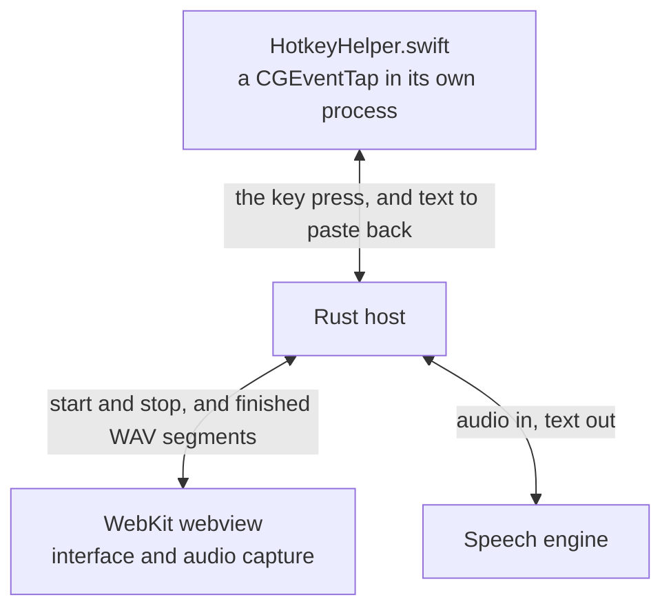

# Architecture

`README.md` has the diagram. This is what each box actually is, and why the
split falls where it does.

## Three processes

```mermaid
flowchart TD
    helper["HotkeyHelper.swift<br/>a CGEventTap in its own process"]
    core["Rust host"]
    web["WebKit webview<br/>interface and audio capture"]
    engine["Speech engine"]

    helper <-->|"the key press, and text to paste back"| core
    core <-->|"start and stop, and finished WAV segments"| web
    core <-->|"audio in, text out"| engine
```

The helper and the Rust host speak newline-delimited JSON over stdio.

**The webview** owns the interface, audio capture, segmentation and the overlay
meter. It talks to Rust through the `window.waveform` surface in
`src/renderer/host.ts`. `getUserMedia`, `AudioContext` and `ScriptProcessorNode`
all work there, so audio never has to cross into Rust — only finished WAV
segments do.

**The Rust host** owns everything the page cannot do for itself: the speech
engines, the dictation state machine, the overlay window, the global shortcuts,
the rewriting -- llama.cpp in-process for the local models, HTTP for OpenRouter --
and the keychain.

**The Swift helper** is neither, and exists because no API lets an app see Fn
pressed while another app is frontmost, or type into one. That needs a
`CGEventTap` and synthetic `CGEvent`s. It is a separate process speaking
newline-delimited JSON over stdio, which is why it survived the move from
Electron untouched.

## Where the code lives

Both sides are split the same way: one file per thing, and an entry point
that only assembles them.

**The Rust host** (`src-tauri/src/`). `lib.rs` is the module list and
`run()`, nothing else.

| Module | What it is |
| --- | --- |
| `bootstrap.rs` | Launch: opens the stores, builds the engines and the recorder, creates the windows, and handles the Reopen and Exit run events |
| `commands/` | Every `#[tauri::command]`, one file per thing it acts on: `settings`, `history`, `dictionary`, `meetings`, `models`, `speech`, `polish`, `dictation`, `overlay`, `updates`, `logs`, `app`. `commands::handler()` lists them all |
| `state.rs` | `AppState`, what the commands and menus share |
| `menu.rs`, `tray.rs` | The application menu and the menu bar icon; `menu::handle_menu_action` serves both |
| `windows.rs`, `overlay_window.rs` | The two webviews by name; the HUD's size, placement and hover poll |
| `bundle.rs` | What the binary knows about its `.app`: display name, data directory, checkout root |
| `dictation.rs`, `gestures.rs`, `hotkey.rs`, `focus.rs` | A dictation session, from key press to paste |
| `meeting.rs`, `meetings.rs`, `audio.rs`, `diarize.rs`, `summary.rs` | Recording a meeting and what is done with it afterwards |
| `model_server.rs`, `whisper_cpp.rs`, `transcribe.rs`, `install.rs`, `download.rs` | The speech engines and their weights |
| `rewrite.rs`, `local_llm.rs` | AI Polish, hosted and local |
| `settings.rs`, `history.rs`, `dictionary.rs`, `stats.rs`, `store.rs` | What is kept on disk |
| `logs.rs`, `resources.rs`, `updates.rs`, `clock.rs`, `paths.rs`, `panel.rs`, `mic.rs` | The rest: the log, the usage monitor, the updater, one clock, where files live, the non-activating panel, native capture |

A command is named by the string the renderer invokes it with, so the names
in `commands/` are part of the contract and the grouping is only for reading.

**The window** (`src/renderer/`). `renderer.ts` installs the bridge, loads
what every page needs at start, subscribes to the host, and fans a settings
change out to the pages.

| Module | What it is |
| --- | --- |
| `pages/` | One file per section of the window: `history`, `dictation`, `setup`, `dictionary`, `meetings`, `models`, `polish`, `overview`, `settings-panel`, `logs`, `updates`, `wizard`. Each owns its elements, its state and its events, and exports what other pages need of it |
| `state.ts` | The facts more than one page reads, and `patchSettings` |
| `navigation.ts` | Which section is on screen |
| `drop-transcribe.ts`, `recording-strip.ts` | Features that belong to no page: the file-drop overlay, the strip shown while a meeting records |
| `ui/` | `dom.ts` (finding elements, the Lucide glyphs), `format.ts` (sizes, times, clocks), `toast.ts` |
| `overlay.ts` | The HUD, a separate window with its own bundle |
| `audio/` | Capture, segmentation, gain and WAV encoding, shared by both windows |
| `host.ts`, `tauri-bridge.ts` | The `window.waveform` surface and its Tauri implementation |

`src/shared/` is the contract between the two: `contracts.ts` names every
command, event and payload, and the tables beside it (`models.ts`,
`polish-models.ts`, `settings.ts`, …) are mirrored by Rust and compared by
tests.

## Why the helper is separate

It does the two things macOS will not let the app do from inside its own
process, and both are gated on permissions the app cannot grant itself:

- Seeing the trigger key while another app is focused, which needs **Input
  Monitoring**.
- Typing the transcribed text into that app, which needs **Accessibility**.

Pasting goes through the pasteboard, because that is the only route into an
arbitrary app's text field. The previous clipboard contents are put back
afterwards.

## Why the engine is separate too

whisper.cpp is linked into the app and runs in-process, which is what makes it
the default: no interpreter, no subprocess, and the weights stay loaded between
phrases. The local polish models are the same bargain made twice: llama.cpp is
linked in beside it (`src-tauri/src/local_llm.rs`), so a rewriting model is also
one file the app can fetch, check and load by itself. Both crates vendor ggml
and share one Metal build in the final binary.

Parakeet and Qwen3-ASR are not. Each brings its own runtime of several hundred
megabytes and runs as a child process, which is also why `install_update` stops
the engine before restarting — a process that size would not notice its parent
being replaced, and the signal handler stops it before exiting for the same
reason.

[models.md](models.md) traces how a model id becomes a running engine and where
each one's weights are looked for.

## The bundle is assembled by hand

`pnpm app` builds `release/Waveform Dev.app` itself rather than calling the Tauri
CLI. WKWebView refuses microphone access to a bare binary, so the executable
has to sit inside a real `.app` carrying `NSMicrophoneUsageDescription`. The
checkout bundle uses a different identifier and display name from a release so
the two do not share TCC grants.

Updater artifacts come only from a real `tauri build`, so the release path and
the everyday path diverge there. [building.md](building.md) covers both.
